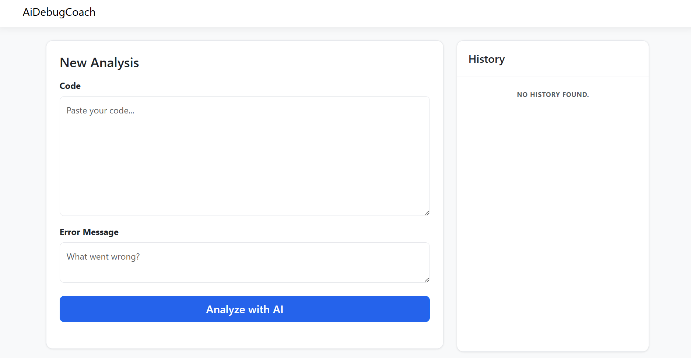

# AI Debug Coach

An AI-powered debugging assistant that analyzes C# code errors and provides actionable fixes using the Gemini API.

---

## Features

- **Intelligent Analysis:** Real-time AI processing to explain code errors and provide step-by-step solutions.
- **Persistent History:** Automatically saves your debugging sessions to a local SQLite database using Entity Framework
  Core.
- **Clean Architecture:** Built with separation of concerns, making it easy to extend or modify.
- **Responsive UI:** Modern, clean interface built with Razor Views and custom CSS.

---

### Getting Started

1. Clone the repo.
2. Run `dotnet user-secrets init`.
3. Run `dotnet user-secrets set "GeminiSettings:ApiKey" "YOUR_ACTUAL_API_KEY"`.
4. Run `dotnet run`.

---

### Screenshots
